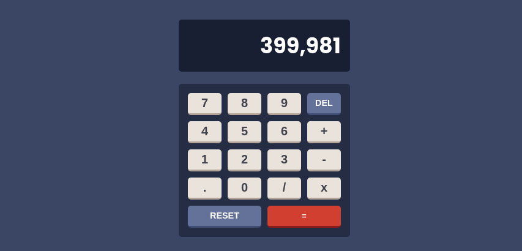

Solução de aplicativo Calculadora

Esta é uma solução para o [desafio do aplicativo Calculadora no Frontend Mentor](https://www.frontendmentor.io/challenges/calculator-app-9lteq5N29). Os desafios do Frontend Mentor ajudam você a melhorar suas habilidades de codificação criando projetos realistas.

- [Visão geral](#visão geral)
  - [O desafio](#the-challenge)
  - [Links](#links)
  - Recursos
  - Desenvolvimento contínuo
  - [Recursos úteis](#useful-resources)
- [Autor](#autor)
- [Agradecimentos](#agradecimentos)

## Visão geral

### O desafio

Os usuários devem ser capazes de:

- Veja o tamanho dos elementos ajustados com base no tamanho da tela do dispositivo
- Realizar operações matemáticas como adição, subtração, multiplicação e divisão
- Ajuste o tema de cores com base em sua preferência
- **Bônus**: verifique a preferência inicial do tema usando `prefers-color-scheme` e tenha quaisquer alterações adicionais salvas no navegador

### Captura de tela

- URL da solução: (https://www.frontendmentor.io/solutions/calculator-challenge-2JV61b9_XQ)
- URL do site ao vivo: (https://beatrizuser.github.io/calculator-challenge.github.io/)

- Marcação HTML5 semântica
- Propriedades personalizadas de CSS
- Flexbox
- Grade CSS

## Autor

- Site - [Adicione seu nome aqui](https://www.your-site.com)
- Mentor de frontend - [@seunomedeusuário](https://www.frontendmentor.io/profile/BeatrizUser)
- LinkedIn - (https://www.linkedin.com/in/ana-beatriz-machado-dev)

## Agradecimentos

Pedro, devo tudo a voçe, cara!
